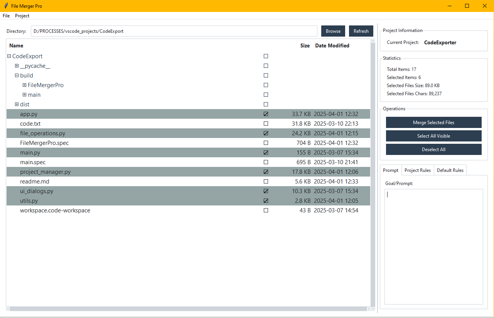

# File Merger Pro 📂✨

A graphical utility built with Python and Tkinter/ttkbootstrap to browse directories, select specific files and folders, and merge their content into a single output file. Includes project management features to save and load configurations, selections, and rules.

**(Consider adding a screenshot or GIF of the application here!)**
<!--  -->

## Overview

File Merger Pro helps you consolidate text-based content from multiple files across a directory structure. It's particularly useful for:

*   Gathering code context for analysis or Large Language Models (LLMs).
*   Combining log files.
*   Creating a single document from various text sources.
*   Managing different sets of files (projects) with their specific settings.

## Features

*   **Intuitive GUI:** Built using Tkinter and styled with ttkbootstrap (`flatly` theme).
*   **File Tree Navigation:**
    *   Browse directories starting from a chosen root.
    *   Display files and folders in a tree view.
    *   Show file size and modification dates.
    *   Lazy loading of directory contents for performance.
*   **Selection:**
    *   Checkboxes next to each item for easy selection/deselection.
    *   Clicking a folder's checkbox toggles selection for all its children recursively.
    *   **Highlighting:** Selected rows are visually highlighted.
    *   Spacebar toggles selection of the focused item.
    *   "Select All Visible" and "Deselect All" options.
*   **Merging:**
    *   Merge content of selected **files** into a single output file.
    *   **Customizable Header:** Include a "Goal/Prompt" and "Project Rules" section at the beginning of the merged file.
    *   **Directory Structure:** Automatically includes a summary of the directory structure of the merged files.
    *   **Line Numbering:** Adds line numbers to the content of each merged file.
    *   **Configurable Output:** Choose the output directory and filename.
    *   Progress bar during merge operation.
*   **Project Management:**
    *   Save and load different "projects".
    *   Each project stores:
        *   Root directory path.
        *   Output directory path.
        *   List of ignored file types/names.
        *   Currently selected files/folders.
        *   Goal/Prompt text.
        *   Project-specific rules.
        *   Default rules template.
    *   Create new projects.
    *   Clone existing projects.
    *   Rename and delete projects.
*   **Configuration:**
    *   Easily edit the list of ignored file types and names (e.g., `.git`, `__pycache__`, `*.log`, binary extensions).
    *   Project settings and preferences are saved automatically to `~/.filemerger/preferences.json`.
*   **Context Menu:** Right-click on tree items for quick actions:
    *   Select/Deselect item and children.
    *   Expand/Collapse item and children recursively.
    *   Open item location in the system's file explorer.
*   **Statistics:** View real-time stats:
    *   Total items loaded in the tree.
    *   Number of selected items.
    *   Total size of selected files.
    *   Total character count of selected files.
*   **Refresh:** Reload the directory view, preserving open folders and selections, and auto-selecting newly added files.

## Installation

1.  **Prerequisites:**
    *   Python 3.x
    *   `pip` (Python package installer)

2.  **Clone the repository:**
    ```bash
    git clone https://github.com/your-username/file-merger-pro.git # Replace with your repo URL
    cd file-merger-pro
    ```

3.  **Install dependencies:**
    *   This project uses `ttkbootstrap`. Create a `requirements.txt` file with the following content:
        ```txt
        ttkbootstrap>=1.10.1 # Or the version you are using
        ```
    *   Install the requirements:
        ```bash
        pip install -r requirements.txt
        ```

## Usage

1.  Navigate to the project directory in your terminal.
2.  Run the application:
    ```bash
    python main.py
    ```
3.  **Using the Application:**
    *   Use the "File" menu or the browse button to set the root directory you want to explore.
    *   Navigate the tree view. Expand folders by double-clicking or clicking the expander icon.
    *   Select files or folders using the checkboxes.
    *   Use the "Project" menu to manage projects (create, load, clone, etc.).
    *   Edit ignored file types under the "Project" menu.
    *   Enter your goal/prompt and project rules in the respective tabs on the right.
    *   Click "Merge Selected Files" to start the merging process. You will be prompted to choose an output file location and name.
    *   Use the context menu (right-click) for additional actions on tree items.

## Configuration

*   Project configurations and application state are stored in `~/.filemerger/preferences.json` (on Windows, this is usually `C:\Users\YourUsername\.filemerger\preferences.json`).
*   Ignored file types and project settings (paths, rules) are managed directly through the application's UI and saved within the project data in the preferences file.

## Development Environment

*   Developed primarily using VS Code on Windows.
*   Code is structured into separate modules for UI (`app.py`, `ui_dialogs.py`), file operations (`file_operations.py`), project management (`project_manager.py`), and utilities (`utils.py`).

## Contributing

Contributions are welcome! Please feel free to submit pull requests or open issues for bugs, feature requests, or improvements.

*(Optional: Add specific contribution guidelines if you have them)*

## License

*(Optional: Add your chosen license here. E.g., MIT License)*